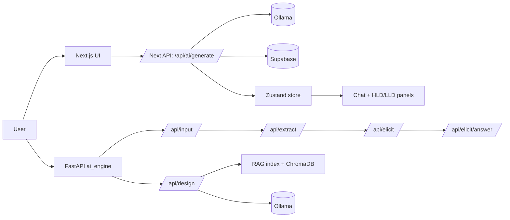

# Project Overview

Date: 2026-07-13

This workspace contains two related applications that currently run as mostly separate layers:

1. `next_app/` - the user-facing Next.js application.
2. `ai_engine/` - a FastAPI-based AI pipeline for requirement extraction, elicitation, and RAG-driven system design.

The project goal is to turn a user prompt, file upload, or requirement description into a structured system design output. The Next.js app already provides a polished chat-style experience, while the Python service contains a more explicit multi-step AI pipeline for requirements and architecture generation.

## High-Level Architecture

The important detail is that the two halves are not wired together yet. The Next.js UI talks to its own Next API routes, and the FastAPI backend exposes a separate pipeline with the same general problem domain.

## What Each Part Does

### 1. Next.js application (`next_app/`)

This is the interactive front end. It contains:

- Authentication pages and API routes under `app/api/auth/`.
- Chat session persistence under `app/api/chat/`.
- A design generation route under `app/api/ai/generate/`.
- UI state management in `lib/store.ts`.
- UI composition in `components/`.

The frontend is visually and functionally more mature than the Python service. It already supports:

- Session creation and session switching.
- Login and signup via Supabase.
- AI generation through Ollama.
- Displaying architecture graphs in HLD and LLD views.

### 2. FastAPI AI engine (`ai_engine/`)

This service is a more explicit backend pipeline. It contains:

- Input ingestion and parsing for text, PDF, DOCX, and images.
- Requirement extraction into a structured JSON schema.
- Elicitation of missing requirements via LLM-generated questions.
- Answer merging to fill gaps.
- A RAG-backed design generator that indexes a system-design knowledge base.

This backend is more ambitious architecturally than the Next.js route, but it is not currently integrated with the UI.

## End-to-End Data Flow

### A. Current user-facing flow in the Next.js app

1. The user opens the chat page at `/chat`.
2. `components/ChatWindow.tsx` collects a prompt from the textarea or starter prompts.
3. If there is no active session, the app creates one locally and, when logged in, also creates a Supabase session through `app/api/chat/session/route.ts`.
4. The chat message is added optimistically to the Zustand store in `lib/store.ts`.
5. The frontend calls `apiGenerate()` from `lib/api.ts`.
6. `app/api/ai/generate/route.ts` builds a prompt and sends it to Ollama at `http://localhost:11434/api/generate`.
7. The route parses the model output as JSON, converts it into React Flow nodes and edges, and stores the result in Supabase as an assistant message when a user id is present.
8. The route returns:
   - a short text summary,
   - HLD graph data,
   - LLD graph data grouped by section.
9. The frontend stores the architecture data in Zustand.
10. `components/ArchitecturePanel.tsx`, `HLDGraph.tsx`, and `LLDGraph.tsx` render the design graph on the right side of the chat UI.

### B. Authentication and session flow in the Next.js app

1. `/signin` and `/signup` use API routes in `app/api/auth/login/route.ts` and `app/api/auth/signup/route.ts`.
2. These routes use Supabase Auth for credential checks.
3. When a user logs in, the app stores the user in Zustand and loads previous sessions from Supabase.
4. `components/Sidebar.tsx` reads chat sessions from `app/api/chat/session/route.ts` and shows them in the session list.
5. Messages are fetched through `app/api/chat/history/route.ts`.

### C. Requirement extraction flow in the FastAPI service

1. `app/routers/input_router.py` accepts plain text and/or uploaded files.
2. `app/services/file_parser.py` extracts text from:
   - `.txt` and `.md`
   - `.pdf`
   - `.docx`
   - `.png`, `.jpg`, `.jpeg` via OCR
3. `app/services/prompt_builder.py` merges all text blocks into one prompt.
4. `app/routers/extraction_router.py` sends that prompt into `app/services/requirement_extractor/pipeline.py`.
5. The extractor chunks large text, calls Ollama, and merges partial JSON results.
6. `app/routers/elicitation_router.py` detects missing parameters and generates clarification questions.
7. `app/services/elicitation/answer_merger.py` merges the user answers back into the parameter structure.

### D. RAG design flow in the FastAPI service

1. `app/routers/design_router.py` exposes `/api/design` and `/api/design/reindex`.
2. `app/services/rag_design/pipeline.py` manages a Chroma-based document index under `.chroma`.
3. The corpus is read from `data/RAG/`.
4. Markdown files are kept atomic; PDF and DOCX files are chunked.
5. A corpus signature is saved so the service can detect when the index is stale.
6. The design pipeline builds a retrieval query from extracted parameters.
7. It performs category-aware retrieval, ranking, and link-hop expansion.
8. It generates HLD first, then per-section LLD outputs for frontend, backend, database, cloud, and security.
9. The output is normalized into a consistent design structure.

## Implementation Details By Layer

### Next.js UI

The UI is reasonably complete.

- `components/ChatWindow.tsx` drives the main chat interaction.
- `components/PromptInput.tsx` handles user text entry.
- `components/Sidebar.tsx` manages sessions and logout.
- `components/ArchitecturePanel.tsx` switches between HLD and LLD views.
- `components/Navbar.tsx` gives the landing page and entry point.
- `lib/store.ts` keeps user, session, and architecture state in Zustand with persistence.
- `lib/api.ts` centralizes client-side API calls.

This layer is not just a mockup. It persists sessions, renders generated graphs, and handles login/signup.

### Next.js API layer

The Next.js API routes are also functional.

- Auth routes talk to Supabase Auth.
- Chat session and history routes persist and retrieve chat data from Supabase tables.
- The AI route calls Ollama directly and returns graph-ready JSON.

The AI route is intentionally self-contained. It does not call the Python backend.

### FastAPI engine

The Python backend has a much deeper architecture than the Next.js route.

- The input router handles multimodal requirement ingestion.
- The requirement extractor is schema-driven and retries JSON parsing.
- Elicitation is implemented as a dedicated second step.
- The design service uses retrieval plus generation rather than a single prompt-only answer.
- RAG indexing is robust enough to track corpus changes and reindex automatically.

This backend looks like a real implementation, not a sketch. However, it is currently a separate system from the frontend experience.

## What Is Implemented Well

1. The chat UX is complete enough for real use.
2. Session persistence and auth are wired through Supabase.
3. Generated architecture is rendered visually, not just as text.
4. The FastAPI service includes a serious pipeline for extraction, elicitation, and RAG design.
5. The RAG corpus is organized into meaningful architecture categories.
6. The design pipeline handles fallbacks, index invalidation, and normalization.

## What Still Needs To Be Done

### 1. Connect the two backends or remove the duplication

Right now there are two design-generation paths:

- Next.js `app/api/ai/generate/route.ts`
- FastAPI `app/routers/design_router.py`

They solve similar problems but are not integrated. This is the biggest architectural gap in the project.

### 2. Add a single source of truth for the generation flow

The project would benefit from one backend boundary:

- either the Next app proxies into the Python AI engine,
- or the Python engine is retired and the Next route becomes the only pipeline.

Without that, the system is harder to maintain, test, and deploy.

### 3. Add Python dependency management

The `ai_engine/` folder currently does not include an obvious `requirements.txt` or `pyproject.toml` in the workspace. That makes the backend harder to reproduce and deploy.

### 4. Add end-to-end tests

There are no obvious automated tests visible in the workspace for:

- file parsing
- extraction JSON validation
- elicitation merging
- RAG indexing and retrieval
- Next.js chat generation
- Supabase persistence flows

### 5. Add an integration contract

The project needs an explicit contract for the structure of:

- extracted parameters
- elicitation questions and answers
- HLD and LLD output
- React Flow graph payloads

This would reduce breakage when one side changes.

### 6. Document startup and environment variables

The code uses a number of environment variables in `ai_engine/app/config.py` and Supabase-related config on the Next.js side. The workspace would benefit from a top-level setup guide that explains:

- how to start Ollama
- how to start the Next.js app
- how to start the FastAPI service
- which environment variables are required
- how to populate the RAG corpus

### 7. Add explicit wiring for the Python AI engine UI path

The FastAPI routes exist, but the Next.js frontend does not call them. If the Python engine is meant to be the canonical pipeline, the UI should be updated to use it.

## Status Summary

| Area | Status | Notes |
| --- | --- | --- |
| Landing page and chat UI | Implemented | Visually complete and interactive |
| Supabase auth and sessions | Implemented | Login, signup, sessions, and history routes exist |
| Graph-based design rendering | Implemented | HLD and LLD visual panels work off generated data |
| Ollama-based AI generation in Next.js | Implemented | Route returns structured graph data |
| Requirement extraction pipeline | Implemented in Python | Not connected to the Next.js UI |
| Elicitation pipeline | Implemented in Python | Not connected to the Next.js UI |
| RAG-based design pipeline | Implemented in Python | Strongest backend logic, but separate from frontend |
| Tests | Missing / not visible | No clear automated coverage in workspace |
| Dependency docs for Python service | Missing / not visible | No requirements file found in workspace |
| Frontend-backend unification | Missing | Main architectural gap |

## Practical Interpretation

If the question is "how complete is this project?", the honest answer is:

- The frontend product is moderately advanced and usable.
- The Next.js + Supabase + Ollama path is the most complete end-to-end experience.
- The Python AI engine is structurally strong and closer to a platform backend, but it is not yet integrated into the main user journey.
- The remaining work is mostly about integration, documentation, test coverage, and choosing one canonical backend path.

## Recommended Next Steps

1. Decide whether the Next.js AI route or the FastAPI AI engine is the primary backend.
2. Add a single integration layer and remove duplicate generation logic.
3. Add Python dependency and startup docs.
4. Add automated tests for the extraction and generation contracts.
5. Add a small API contract document for the request and response schemas.
