# Archova.ai (ArchAI) — Autonomous Multi-Agent AI System Architecture Platform

> **Transforming raw, ambiguous requirements into production-ready software architectures, formal specifications, and interactive visual topologies.**

[](https://nextjs.org/)
[](https://react.dev/)
[](https://www.typescriptlang.org/)
[](https://tailwindcss.com/)
[](https://fastapi.tiangolo.com/)
[](https://www.python.org/)
[](https://qdrant.tech/)
[](https://reactflow.dev/)
[](https://supabase.com/)
[](https://openrouter.ai/)

---

## 📌 Executive Summary

**Archova.ai** (internally branded as **ArchAI**) is an enterprise-grade, multi-agent AI software architecture generation platform. It automates the entire software architecture lifecycle: from ingesting high-level, unstructured stakeholder problem statements or multimodal documents (PDF, DOCX, TXT, OCR images) to generating complete, verified, and production-ready architectural deliverables.

### The Problem It Solves
Translating vague, ambiguity-ridden stakeholder expectations into resilient, scalable, and enterprise-grade software architectures is traditionally one of the slowest and most expensive phases of software engineering. Manual requirements elicitation often misses edge cases, architectural patterns are inconsistently applied, and translating High-Level Designs (HLD) into domain-specific Low-Level Designs (LLDs) across frontend, backend, database, security, and cloud infrastructure takes weeks of senior engineering effort.

### The Archova.ai Solution
Archova.ai replaces ad-hoc design processes with a disciplined, multi-agent dual-engine pipeline:
1. **Requirements Engineering Engine (REE)**: Extracts requirements, pinpoints ambiguities, conducts an interactive clarification interview with the stakeholder, and synthesizes a formal **ARSRS** (Architecture-Ready Structured Requirements Specification).
2. **Software Architecture Engine (SAE)**: Retrieves domain patterns from a 22-category RAG vector database and synthesizes an interactive visual **High-Level Design (HLD)** graph topology.
3. **5 Parallel Low-Level Design (LLD) Synthesizers**: Concurrently outputs complete technical implementation specifications for **Backend**, **Frontend**, **Database**, **Security**, and **Cloud Infrastructure**.
4. **Real-time Pipeline Telemetry**: Streams live execution events, agent handoffs, and audit logs to the user interface via Server-Sent Events (SSE).

---

## 🏛️ High-Level System Architecture

Archova.ai adopts a modular, decoupled architecture consisting of two primary operational layers: a modern **Next.js 16 Web Application** and a high-performance **FastAPI AI Engine**, complemented by a **Qdrant Vector Database** and an **OpenRouter / Ollama LLM Gateway**.

```mermaid
flowchart TD
    subgraph ClientLayer ["Client & Presentation Layer (Next.js 16 / React 19)"]
        UI["Modern Web UI & Landing Page"]
        Chat["Interactive Chat & Prompt Ingestion"]
        InterviewUI["Stakeholder Clarification Interview Card"]
        ArsrsUI["ARSRS Formal Specification Viewer"]
        HldCanvas["Interactive React Flow HLD Graph"]
        LldDashboard["5-Domain LLD Workspace (Tabs & Visual Graphs)"]
        Console["Real-Time SSE Terminal Console"]
    end

    subgraph AppServer ["Next.js App Router API (/api/v1 & Native Engine)"]
        GenRoute["/api/v1/generations (Session Coordinator)"]
        AnswerRoute["/api/v1/generations/[id]/answers"]
        HldRoute["/api/v1/generations/[id]/generate"]
        LldRoute["/api/v1/generations/[id]/lld/[type]"]
        SseRoute["/api/v1/generations/[id]/logs/stream (SSE)"]
        NativeEngine["In-Memory Generation Store & Native Pipeline"]
    end

    subgraph PythonBackend ["FastAPI AI Engine (ai_engine: Port 8000)"]
        InputRouter["Multimodal Ingestion (PDF, DOCX, OCR, Text)"]
        
        subgraph REE ["Requirements Engineering Engine (REE)"]
            InputAgent["Input Understanding Agent"]
            BaAgent["Business Analyst Agent"]
            DomainAgent["Domain Expert Agent"]
            ReqEngAgent["Requirement Engineer Agent"]
            ModeratorAgent["Interview Moderator Agent"]
            ReviewAgent["Requirement Review Agent"]
            ArsrsSynthesizer["ARSRS Finalizer"]
        end
        
        subgraph SAE ["Software Architecture Engine (SAE)"]
            ReqAnalysisAgent["Requirement Analysis Agent"]
            TechAdvisorAgent["Technology Advisor Agent"]
            HldAgent["HLD Generation Agent"]
            
            subgraph LLDGenerators ["Parallel LLD Engines"]
                BackendLld["Backend LLD Agent"]
                FrontendLld["Frontend LLD Agent"]
                DbLld["Database LLD Agent"]
                SecurityLld["Security LLD Agent"]
                CloudLld["Cloud LLD Agent"]
            end
            
            AdversarialAgent["Adversarial Review Agent"]
            ObservabilityAgent["Observability & Runbook Agent"]
        end
    end

    subgraph RagSubsystem ["Knowledge Layer (Production RAG)"]
        QdrantDB[("Qdrant Vector DB\n(Collection: architecture_rag)")]
        LocalDisk[("Local Storage Fallback\n(.qdrant_data)")]
        BgeEmbeddings["BAAI/bge-small-en-v1.5\n(SentenceTransformers)"]
        Corpus["22 Architectural Domains\n(data/RAG/**/*.md)"]
    end

    subgraph CloudAndStorage ["External Services & Persistence"]
        OpenRouter["OpenRouter Gateway\n(Gemini Flash, Llama 3.3 70B, DeepSeek R1)"]
        OllamaLocal["Local Ollama Fallback\n(mistral: localhost:11434)"]
        SupabaseAuth[("Supabase Auth & PostgreSQL\n(chat_sessions, messages)")]
    end

    %% Client Interactions
    UI --> Chat
    Chat --> GenRoute
    InterviewUI --> AnswerRoute
    ArsrsUI --> HldRoute
    HldCanvas --> LldRoute
    Console -.->|EventSource SSE| SseRoute

    %% App Server routing
    GenRoute --> NativeEngine
    GenRoute -.->|Proxy Option| PythonBackend
    NativeEngine --> SupabaseAuth

    %% Python Backend Pipeline
    InputRouter --> InputAgent
    InputAgent --> BaAgent & DomainAgent & ReqEngAgent
    ReqEngAgent --> ModeratorAgent
    ModeratorAgent --> ReviewAgent
    ReviewAgent --> ArsrsSynthesizer
    ArsrsSynthesizer --> ReqAnalysisAgent
    ReqAnalysisAgent --> TechAdvisorAgent
    TechAdvisorAgent --> HldAgent
    HldAgent --> BackendLld & FrontendLld & DbLld & SecurityLld & CloudLld
    BackendLld & FrontendLld & DbLld & SecurityLld & CloudLld --> AdversarialAgent
    AdversarialAgent --> ObservabilityAgent

    %% RAG Connections
    Corpus --> BgeEmbeddings --> QdrantDB
    QdrantDB -.->|Fallback| LocalDisk
    HldAgent & BackendLld & DbLld & SecurityLld & CloudLld <-->|MMR Query & Retrieval| QdrantDB

    %% LLM Connections
    REE & SAE <--> OpenRouter
    REE & SAE <--> OllamaLocal
```



---

## ⚡ Key Features & Capabilities

### 1. Requirements Engineering Engine (REE)
- **Natural Language & Multimodal Ingestion**: Accepts raw text prompts or document uploads (`.pdf`, `.docx`, `.txt`, `.md`) and scanned architecture diagrams via Tesseract OCR (`.png`, `.jpg`, `.jpeg`).
- **Automated Ambiguity Detection**: Flags vague, missing, or conflicting requirements across 11 critical parameters: *goal, core objectives, system type, actors, functional requirements, inputs, outputs, external services, system behaviour, non-functional requirements (NFRs), and free constraints*.
- **Interactive Stakeholder Clarification Interview**: Generates a dynamic series of contextual multiple-choice questions with default recommendations to resolve ambiguities before designing the architecture.
- **Formal ARSRS Specification**: Synthesizes a structured, downloadable **Architecture-Ready Structured Requirements Specification (ARSRS)** document with strict schemas.

### 2. Software Architecture Engine (SAE)
- **Interactive Visual HLD Graph**: Generates a complete High-Level Design topology rendered via React Flow (`@xyflow/react`). Includes custom node layouts, service boundaries, communication protocols (REST, gRPC, WebSocket, Kafka), and a clickable node inspector modal.
- **5 Concurrent Low-Level Design (LLD) Generators**:
  - **Backend LLD**: API endpoint specifications, service class architectures, background job queues, distributed caching, circuit breakers, and database access patterns.
  - **Frontend LLD**: Component hierarchy, state management stores (Zustand/Redux), client-side routing, data fetching, optimistic mutations, and asset optimization.
  - **Database LLD**: Relational / NoSQL data models, schema definitions, primary/foreign keys, indexing strategies, partition schemes, and migration plans.
  - **Security LLD**: Authentication (OAuth2, OIDC, JWT), Role-Based Access Control (RBAC), data encryption (AES-256 at rest, TLS 1.3 in transit), OWASP Top 10 mitigation, and rate limiting.
  - **Cloud Infrastructure LLD**: VPC topology, subnet segregation, Kubernetes deployment manifests, auto-scaling policies, CDN configuration, and Infrastructure-as-Code (Terraform/OpenTofu).
- **Adversarial Architecture Review**: Automated cross-validation verifying that the LLDs do not violate NFR constraints or HLD boundaries.

### 3. Production RAG Subsystem
- **Domain-Curated Knowledge Base**: Indexes over **22 architectural domains** containing patterns, trade-off matrices, failure modes, and industry best practices.
- **Vector Search with Qdrant**: Operates against a Qdrant vector database with automatic fallback to embedded local disk storage (`.qdrant_data/`).
- **Intelligent Retrieval Pipeline**:
  - SentenceTransformers embeddings (`BAAI/bge-small-en-v1.5`, 384-dimensional).
  - Semantic query expansion (generating 3 targeted sub-queries per architectural domain).
  - Intent detection & category routing (filtering from 22 architectural categories down to relevant domains).
  - Maximal Marginal Relevance (MMR, $\lambda=0.7$) to balance relevance with diversity.
  - Diversity capping (maximum 1 chunk per source document to prevent knowledge starvation).
  - Optional cross-encoder reranking (`BAAI/bge-reranker-base`).

### 4. Zero-Cost Multi-LLM Gateway
- **OpenRouter Free Tier Optimization**: Pre-configured to utilize high-performance free models on OpenRouter, guaranteeing zero API billing costs:
  - `google/gemini-2.5-flash-lite:free` (Input parsing, entity extraction, questions)
  - `google/gemini-2.5-flash:free` (Review, validation, architecture analysis)
  - `meta-llama/llama-3.3-70b-instruct:free` (Technology advisory, HLD, LLD generation)
  - `deepseek/deepseek-r1:free` (Complex reasoning, planning, trade-off analysis)
- **Local Ollama Support**: Zero-cloud, 100% offline air-gapped support via local Ollama instances (e.g., `mistral`, `llama3`).

### 5. Full-Stack Modern Web Experience
- **Next.js 16 & React 19**: Built with modern Server and Client components, Tailwind CSS v4, and Lucide React icons.
- **4-Stage Pipeline Stepper**: Guided workflow through (1) Input & Interview, (2) ARSRS Specification, (3) HLD Topology, and (4) LLD Domain Matrix.
- **Real-Time Terminal Console**: Integrated developer console streaming live pipeline logs, agent transitions, and status updates via Server-Sent Events (SSE).
- **Session Persistence & Auth**: Supabase authentication (email/password) and PostgreSQL chat history storage, with automatic mock fallback for instant local evaluation without credentials.

---

## 📂 Project Repository Structure

```
Archova.ai/
│
├── README.md                           # Master project documentation (this file)
├── PROJECT_OVERVIEW.md                 # Architecture review and roadmap notes
├── Major_Project_Phase1_Review.pptx    # Capstone / Major Project Presentation
├── render.yaml                         # One-click deployment specification for Render
│
├── next_app/                           # Presentation & Application Layer (Next.js 16)
│   ├── app/
│   │   ├── api/
│   │   │   ├── auth/                   # Supabase authentication endpoints (login, signup)
│   │   │   ├── chat/                   # Session & history persistence endpoints
│   │   │   ├── ai/generate/            # Legacy AI generation endpoint
│   │   │   └── v1/                     # Modern Architecture Engine API Routes
│   │   │       ├── health/             # System health & engine readiness
│   │   │       └── generations/        # Generation lifecycle, interview, HLD, LLDs, SSE logs
│   │   ├── chat/page.tsx               # Main 4-step architecture generation workbench
│   │   ├── signin/ & signup/           # User authentication pages
│   │   ├── landing.tsx                 # High-converting landing page
│   │   ├── layout.tsx & globals.css    # Root layout & Tailwind v4 styles
│   │   └── page.tsx                    # Root landing page wrapper
│   ├── components/
│   │   ├── ArsrsView.tsx               # ARSRS specification table & JSON viewer
│   │   ├── ChatWindow.tsx              # Main chat interaction & prompt submission
│   │   ├── ExplainModal.tsx            # Node inspector & architecture detail popup
│   │   ├── HLDGraph.tsx                # React Flow High-Level Design visual canvas
│   │   ├── HldView.tsx                 # HLD container with controls & export
│   │   ├── InterviewCard.tsx           # Clarification interview interactive question card
│   │   ├── LLDDashboard.tsx            # 5-domain LLD tabbed workspace
│   │   ├── LLDGraph.tsx                # React Flow Low-Level Design visual graph
│   │   ├── LldsView.tsx                # LLD container & export manager
│   │   ├── Navbar.tsx                  # Header with engine health status badge
│   │   ├── PipelineStepper.tsx         # 4-stage pipeline navigation stepper
│   │   ├── PromptInput.tsx             # Textarea input with starter prompt templates
│   │   ├── Sidebar.tsx                 # Session history sidebar & user profile
│   │   ├── TerminalConsole.tsx         # Live SSE log streaming terminal
│   │   └── ThemeToggle.tsx             # Dark / Light theme switcher
│   ├── lib/
│   │   ├── ai-engine-client.ts         # Unified API client for Next.js & FastAPI engines
│   │   ├── dummy-data.ts               # Offline fallback architecture specifications
│   │   ├── graph-parser.ts             # Raw LLM JSON → React Flow nodes/edges parser
│   │   ├── store.ts                    # Global reactive state management (Zustand)
│   │   ├── supabaseClient.ts           # Supabase JS client configuration
│   │   └── engine/                     # Embedded Native Next.js Architecture Engine
│   │       ├── ree.ts                  # In-app Requirements Engineering logic
│   │       ├── sae.ts                  # In-app Software Architecture synthesis logic
│   │       ├── lld.ts                  # In-app Low-Level Design synthesis logic
│   │       └── session-store.ts        # In-memory session store with SSE event dispatching
│   ├── supabase/migrations/            # PostgreSQL schemas for sessions & messages
│   └── package.json                    # Next.js dependencies & scripts
│
└── ai_engine/                          # Intelligence & Synthesis Layer (FastAPI)
    ├── app/
    │   ├── main.py                     # FastAPI application entrypoint & CORS
    │   ├── config/
    │   │   ├── app_config.py           # Core application & server settings
    │   │   └── model_config.py         # OpenRouter / Ollama model configuration & mappings
    │   ├── routers/
    │   │   ├── input_router.py         # POST /api/input (multimodal file parsing & OCR)
    │   │   ├── ree_router.py           # REE extraction & clarification endpoints
    │   │   ├── sae_router.py           # SAE HLD & LLD generation endpoints
    │   │   └── __init__.py             # Master API router aggregator
    │   ├── api/routes/
    │   │   └── generations.py          # /api/v1/generations compatible endpoints
    │   ├── ree/                        # Requirements Engineering Engine Subsystem
    │   │   ├── orchestrator.py         # REE multi-agent coordinator
    │   │   ├── models.py               # Pydantic models for requirements & ARSRS schemas
    │   │   └── agents/                 # Specialized REE Agent Implementations
    │   │       ├── input_understanding.py
    │   │       ├── business_analyst.py
    │   │       ├── domain_expert.py
    │   │       ├── requirement_engineer.py
    │   │       ├── interview_moderator.py
    │   │       ├── requirement_review.py
    │   │       ├── answer_merger.py
    │   │       └── finalizer.py
    │   ├── sae/                        # Software Architecture Engine Subsystem
    │   │   ├── pipeline.py             # SAE multi-agent coordinator
    │   │   └── agents/                 # Specialized SAE Agent Implementations
    │   │       ├── requirement_analysis_agent.py
    │   │       ├── technology_advisor_agent.py
    │   │       ├── hld_generation_agent.py
    │   │       ├── backend_lld_generation_agent.py
    │   │       ├── frontend_lld_generation_agent.py
    │   │       ├── database_lld_generation_agent.py
    │   │       ├── security_lld_generation_agent.py
    │   │       ├── cloud_lld_generation_agent.py
    │   │       ├── adversarial_review_agent.py
    │   │       ├── observability_agent.py
    │   │       └── runbook_agent.py
    │   └── services/
    │       ├── file_parser.py          # PDF, DOCX, TXT, and Tesseract OCR parser
    │       ├── generation_service.py   # State machine for generation sessions
    │       └── design_service.py       # RAG-backed design generation pipeline
    ├── backend/rag/                    # Production RAG Engine Library
    │   ├── config.py                   # Centralized RAG parameters & constants
    │   ├── loader.py                   # Recursive Markdown corpus loader
    │   ├── metadata.py                 # Filepath metadata extractor
    │   ├── chunker.py                  # RecursiveCharacterTextSplitter implementation
    │   ├── embeddings.py               # SentenceTransformer (BAAI/bge-small-en-v1.5)
    │   ├── qdrant_manager.py           # Qdrant client, collections & points lifecycle
    │   ├── ingestion.py                # Batch ingestion & vectorization pipeline
    │   ├── query_builder.py            # Intent detection & query expansion
    │   ├── retriever.py                # Semantic search, MMR & category filtering
    │   └── context_builder.py          # Context assembly & deduplication
    ├── data/RAG/                       # 22 Architecture Knowledge Base Domains
    ├── scripts/                        # CLI Tools, REPLs & Benchmarks
    │   ├── pipeline_console.py         # Full interactive CLI generation terminal
    │   ├── rag_query.py                # Interactive vector search REPL & reindexer
    │   ├── rag_retrieval_debugger.py   # Retrieval diagnostics & report tool
    │   ├── benchmark_models.py         # LLM latency & token benchmark suite
    │   └── verify_domains_deterministic.py # Schema & domain isolation verification
    ├── test-frontend/                  # Lightweight standalone HTML/JS test UI (/ui)
    ├── tests/                          # Pytest test suite (unit, regression, E2E)
    ├── requirements.txt                # Python package dependencies
    └── .env.example                    # Template for environment variables
```

---

## 🧠 Subsystems Detailed Specification

### 1. Requirements Engineering Engine (REE)

The REE subsystem is responsible for converting ambiguous human inputs into an unambiguous, structured technical contract:

```
User Input (Text / Files)
       │
       ▼
[Input Understanding Agent] ──▶ Strips noise, identifies domain, normalizes text
       │
       ▼
[Business Analyst Agent] ────▶ Identifies business goals, actors, user journeys
       │
       ▼
[Domain Expert Agent] ───────▶ Supplies domain standards (e.g. HIPAA for Health, PCI-DSS for Fintech)
       │
       ▼
[Requirement Engineer Agent] ─▶ Synthesizes formal Functional & Non-Functional Requirements (NFRs)
       │
       ▼
[Interview Moderator Agent] ──▶ Identifies missing information; creates multiple-choice Q&A
       │
       ▼
(User submits answers in UI)
       │
       ▼
[Answer Merger & Review] ────▶ Validates consistency, resolves conflicts
       │
       ▼
[ARSRS Finalizer] ───────────▶ Outputs formal Architecture-Ready Structured Requirements Specification
```

#### Output Schema: ARSRS Document
The resulting ARSRS JSON document contains:
- **System Overview**: Project name, executive summary, business goals, target scale (DAU/MAU, QPS, data volume).
- **Actors & Personas**: Roles, permissions, access patterns.
- **Functional Requirements (FR)**: Categorized modules with acceptance criteria and input/output contracts.
- **Non-Functional Requirements (NFR)**: Quantitative latency (p95/p99), availability SLA (99.99%), throughput, compliance, security tier.
- **Domain Constraints**: Technology boundaries, budget/cloud restrictions, regulatory frameworks.

---

### 2. Software Architecture Engine (SAE)

Once the ARSRS is locked, the SAE activates its multi-agent synthesis team:

```
ARSRS Specification + RAG Retrieved Context
                    │
                    ▼
       [Requirement Analysis Agent]
                    │
                    ▼
       [Technology Advisor Agent]
                    │
                    ▼
         [HLD Generation Agent]
                    │
     ┌──────────────┴──────────────────────────────┐
     │                                             │
     ▼                                             ▼
HLD Visual Topology Graph             5 Parallel LLD Generation Agents
(Nodes, Edges, Microservices)         ├── 1. Backend LLD Agent
                                      ├── 2. Frontend LLD Agent
                                      ├── 3. Database LLD Agent
                                      ├── 4. Security LLD Agent
                                      └── 5. Cloud Infrastructure LLD Agent
                                                   │
                                                   ▼
                                      [Adversarial Review Agent]
                                                   │
                                                   ▼
                                      [Observability & Runbook Agent]
```

#### The 5 LLD Domain Specifications

| Domain | Focus Areas | Key Output Artifacts |
|---|---|---|
| **Backend LLD** | Application services, API controllers, worker threads, async queues, circuit breakers | OpenAPI specs, Controller/Service/Repository hierarchies, Redis caching strategies, RabbitMQ/Kafka topics |
| **Frontend LLD** | Client architecture, state stores, view routing, component hierarchies | Component trees, Zustand/Redux slice definitions, API client caching rules, bundle splitting |
| **Database LLD** | Persistence layer, data consistency, indexing, high availability | Relational schemas (DDL), NoSQL document collections, ER relationships, index definitions, partition keys |
| **Security LLD** | Defense-in-depth, identity, data privacy, threat mitigation | Authentication flows (JWT/OAuth2), RBAC matrix, encryption schemes (TLS/AES), OWASP Top 10 controls |
| **Cloud LLD** | Infrastructure topology, containerization, deployment, resilience | VPC / Subnet topology, Kubernetes Deployment/Service manifests, Terraform HCL blocks, auto-scaling rules |

---

### 3. RAG Architecture Knowledge Base (22 Domains)

Archova.ai’s design decisions are grounded in real-world architectural knowledge curated in `ai_engine/data/RAG/`:

| Index | Category / Domain | Description & Architectural Focus |
|:---:|---|---|
| **01** | `category_1_architecture_patterns` | Monoliths, Microservices, Event-Driven, CQRS, Hexagonal, Clean Architecture |
| **02** | `category_2_architecture_decisions` | ADR templates, trade-off evaluation matrices, technology selection criteria |
| **03** | `category_3_scaling_techniques` | Horizontal/Vertical scaling, sharding, read replicas, database connection pooling |
| **04** | `category_4_caching_strategies` | Cache-Aside, Write-Through, Write-Behind, Refresh-Ahead, Redis / Memcached |
| **05** | `category_5_database_design` | ACID vs. BASE, Polyglot persistence, SQL vs. NoSQL vs. NewSQL, indexing |
| **06** | `category_6_messaging_systems` | Apache Kafka, RabbitMQ, AWS SQS/SNS, publish-subscribe, stream processing |
| **07** | `category_7_infrastructure_components` | Reverse proxies (Nginx/Envoy), API Gateways (Kong), Load Balancers (ALB) |
| **08** | `category_8_deployment_strategies` | Blue-Green, Canary, Rolling Deployments, Feature Flags, GitOps |
| **09** | `category_9_security_architecture` | Zero Trust, OAuth2, OpenID Connect, mTLS, Secret management (Vault) |
| **10** | `category_10_real_world_systems` | Case studies: Uber, Netflix, Amazon, Twitter/X, Stripe, Airbnb |
| **11** | `category_11_failure_modes` | Cascading failures, thundering herds, split-brain, rate limiting, circuit breakers |
| **12** | `category_12_application_archetypes` | E-commerce, Ride-sharing, Video streaming, IoT, FinTech, SaaS |
| **13** | `ai_systems` | LLM hosting, vector stores, RAG architectures, model inference pipelines |
| **14** | `architecture_decision_matrix` | Standardized decision records comparing latency, cost, and complexity |
| **15** | `cloud_architecture` | AWS, GCP, and Azure reference architectures, serverless vs. containers |
| **16** | `domain_architectures` | Healthcare, Banking, Logistics, EdTech, Real Estate architectures |
| **17** | `hld_templates` | Standardized high-level topology structures and node contracts |
| **18** | `lld_templates` | Boilerplates for backend services, database DDL, and API specs |
| **19** | `nfr_mapping` | Formulas to translate DAU/MAU into QPS, bandwidth, and storage capacity |
| **20** | `production_readiness` | Production readiness checklists, health checks, graceful shutdown |
| **21** | `system_components` | Storage engines, search engines (Elasticsearch), task schedulers (Celery) |
| **22** | `technology_guides` | In-depth comparisons: Postgres vs. MySQL, gRPC vs. REST, Kafka vs. Pulsar |

---

### 4. Interactive 4-Stage UI Workflow

The user interface in `next_app/` guides the user through four progressive tabs:

```
[ Step 1: Input & Clarification ]
              │
              ▼ (Submit Prompt & Complete Interview)
[ Step 2: ARSRS Specification ]
              │
              ▼ (Approve Requirements & Click "Generate Architecture")
[ Step 3: High-Level Design Graph ]
              │
              ▼ (Explore Topology & Inspect Services)
[ Step 4: 5 Low-Level Designs Dashboard ]
              │
              ├── Backend LLD (APIs, Services, Caching)
              ├── Frontend LLD (Components, State, Routes)
              ├── Database LLD (Schemas, Tables, Keys)
              ├── Security LLD (Auth, RBAC, Encryption)
              └── Cloud LLD (Kubernetes, VPC, Terraform)
```

- **Step 1: Input & Clarification Interview**:
  - The user provides an initial prompt (or selects a sample prompt like *Event Management*, *College Library*, or *Smart Parking*).
  - The interview card displays questions dynamically generated by the REE Interview Moderator.
  - The user selects answers with instant visual feedback and priority markers.
- **Step 2: ARSRS Specification**:
  - Displays the synthesized requirements specification with structured tables for functional modules, quantitative NFRs, constraints, and data schemas.
- **Step 3: High-Level Design (HLD)**:
  - An interactive React Flow canvas with zoom, pan, minimap, and background grid.
  - Microservices and components are color-coded by tier (Client, Gateway, Services, Cache, Database, Queue).
  - Clicking any node opens an **Explain Modal** detailing the service's role, API protocols, technologies, and failure mitigation strategies.
- **Step 4: 5 LLD Domain Workspace**:
  - A tabbed dashboard allowing engineers to inspect deep-dive technical specs across all 5 disciplines.
  - Interactive visual graphs showing class hierarchies, entity-relationship diagrams, and infrastructure topologies.
- **Real-Time Terminal Console**:
  - Accessible from any step, providing live SSE streaming logs (`INFO`, `WARNING`, `ERROR`) detailing agent thought processes and stage execution timestamps.

---

## 🔌 API Reference & Contracts

Archova.ai provides a unified RESTful and streaming API surface implemented in both the **Next.js App Router** (`next_app/app/api/v1/`) and the **FastAPI AI Engine** (`ai_engine/app/api/routes/generations.py`).

### Endpoints Overview

| Method | Endpoint | Description |
|:---:|---|---|
| `GET` | `/api/v1/health` | Service health, version, and active session count |
| `POST` | `/api/v1/generations` | Initialize a new generation session from a problem statement |
| `POST` | `/api/v1/generations/{id}/answers` | Submit an answer to a clarification question |
| `POST` | `/api/v1/generations/{id}/generate` | Synthesize the formal ARSRS document and HLD graph |
| `GET` | `/api/v1/generations/{id}/lld/{type}` | Fetch a specific LLD (`backend`, `frontend`, `database`, `security`, `cloud`) |
| `GET` | `/api/v1/generations/{id}/status` | Check overall session and LLD synthesis status |
| `GET` | `/api/v1/generations/{id}/logs` | Retrieve historical execution logs |
| `GET` | `/api/v1/generations/{id}/logs/stream` | Real-time Server-Sent Events (SSE) log stream |
| `POST` | `/api/input` | *(FastAPI only)* Ingest text and multimodal files (PDF, DOCX, OCR) |
| `POST` | `/api/design/reindex` | *(FastAPI only)* Rebuild the Qdrant vector database index |

---

### Request & Response Examples

#### 1. Start Generation Session
`POST /api/v1/generations`

**Request:**
```json
{
  "prompt": "Build a scalable real-time food delivery tracking platform handling 50,000 concurrent orders."
}
```

**Response (200 OK):**
```json
{
  "generation_id": "gen_a8f3b9c102",
  "status": "INTERVIEW_IN_PROGRESS",
  "current_question": {
    "question_id": "q_1",
    "question": "What is the expected real-time GPS location update frequency for active drivers?",
    "priority": "high",
    "rationale": "Directly influences WebSocket connection scaling, message broker throughput, and database write IOPS.",
    "options": [
      "High frequency: Every 3 to 5 seconds via WebSockets (Sub-second dispatch accuracy)",
      "Moderate frequency: Every 15 to 30 seconds via HTTP polling / MQTT",
      "Low frequency: On status change only (Driver Arrived, Order Picked Up)"
    ],
    "default_option": "High frequency: Every 3 to 5 seconds via WebSockets (Sub-second dispatch accuracy)"
  }
}
```

#### 2. Submit Interview Answer
`POST /api/v1/generations/{id}/answers`

**Request:**
```json
{
  "question_id": "q_1",
  "answer": "High frequency: Every 3 to 5 seconds via WebSockets (Sub-second dispatch accuracy)"
}
```

**Response (200 OK):**
```json
{
  "generation_id": "gen_a8f3b9c102",
  "status": "INTERVIEW_IN_PROGRESS",
  "next_question": {
    "question_id": "q_2",
    "question": "What is the primary target cloud infrastructure provider?",
    "priority": "medium",
    "options": ["AWS (Amazon Web Services)", "GCP (Google Cloud Platform)", "Azure", "Cloud-Agnostic Kubernetes"],
    "default_option": "AWS (Amazon Web Services)"
  }
}
```

#### 3. Synthesize Architecture (ARSRS + HLD)
`POST /api/v1/generations/{id}/generate`

**Response (200 OK):**
```json
{
  "generation_id": "gen_a8f3b9c102",
  "status": "COMPLETED",
  "arsrs": {
    "system_name": "Real-Time Food Delivery Tracking Platform",
    "target_scale": {
      "concurrent_orders": 50000,
      "peak_qps": 12500,
      "storage_growth": "25 GB / day"
    },
    "functional_requirements": [
      { "id": "FR-01", "module": "Live Tracking", "description": "WebSocket-based live GPS beacon ingestion and driver-customer pairing." }
    ],
    "non_functional_requirements": {
      "p99_latency": "< 250ms",
      "availability": "99.99%",
      "recovery_point_objective": "0 minutes (Zero data loss)"
    }
  },
  "hld": {
    "nodes": [
      { "id": "client-mobile", "type": "clientNode", "data": { "label": "Driver & Customer Mobile Apps" } },
      { "id": "api-gateway", "type": "gatewayNode", "data": { "label": "Kong API Gateway / Envoy" } },
      { "id": "ws-tracking-service", "type": "serviceNode", "data": { "label": "WebSocket Fleet Tracking Service" } },
      { "id": "kafka-cluster", "type": "queueNode", "data": { "label": "Apache Kafka GPS Telemetry Stream" } },
      { "id": "redis-cache", "type": "cacheNode", "data": { "label": "Redis Geospatial Index" } },
      { "id": "postgres-db", "type": "databaseNode", "data": { "label": "PostgreSQL (TimescaleDB / PostGIS)" } }
    ],
    "edges": [
      { "id": "e1", "source": "client-mobile", "target": "api-gateway", "label": "WSS / HTTPS" },
      { "id": "e2", "source": "api-gateway", "target": "ws-tracking-service", "label": "gRPC" },
      { "id": "e3", "source": "ws-tracking-service", "target": "kafka-cluster", "label": "Pub/Sub" },
      { "id": "e4", "source": "ws-tracking-service", "target": "redis-cache", "label": "GEOADD" },
      { "id": "e5", "source": "kafka-cluster", "target": "postgres-db", "label": "Batch Sink" }
    ]
  }
}
```

#### 4. Real-Time Log Streaming via SSE
`GET /api/v1/generations/{id}/logs/stream`

**Event Stream (text/event-stream):**
```
data: {"timestamp":"21:30:12","stage":"REE","level":"INFO","message":"Starting REE Input Understanding Agent analysis..."}

data: {"timestamp":"21:30:14","stage":"RAG","level":"INFO","message":"Retrieved 10 documents from Qdrant across categories: category_3_scaling_techniques, category_6_messaging_systems"}

data: {"timestamp":"21:30:18","stage":"SAE","level":"INFO","message":"Synthesizing High-Level Design (HLD) topology..."}

data: {"timestamp":"21:30:22","stage":"LLD_PARALLEL","level":"INFO","message":"Dispatching 5 parallel LLD generators (Backend, Frontend, Database, Security, Cloud)..."}

data: {"timestamp":"21:30:26","stage":"COMPLETED","level":"INFO","message":"Architecture synthesis completed successfully."}
```

---

## 🚀 Setup & Installation Guide

Archova.ai is designed to run either as a **cohesive microservice system** (Next.js + FastAPI) or in **standalone web mode** (Next.js with the built-in native engine).

### Prerequisites

| Tool | Minimum Version | Recommended | Purpose |
|---|:---:|:---:|---|
| **Node.js** | `v18.18.0` | `v20.x LTS` | Next.js frontend & native engine runtime |
| **npm** | `9.x` | `10.x` | Package manager for frontend |
| **Python** | `3.10` | `3.11.9` | FastAPI AI Engine runtime |
| **Git** | `2.x` | Latest | Version control |
| *(Optional)* **Ollama** | Latest | `v0.3+` | Local offline LLM execution |
| *(Optional)* **Tesseract OCR** | `v5.x` | Latest | For parsing scanned diagram images |

---

### Option A: Complete Microservices Setup (Recommended)

Run both the **Next.js 16 Web Application** and the **FastAPI AI Engine** together for full multi-agent RAG capabilities.

#### 1. Clone the Repository
```bash
git clone https://github.com/Harshal-SL/Archova.ai.git
cd Archova.ai
```

#### 2. Set Up the FastAPI AI Engine
```bash
cd ai_engine

# Create and activate Python virtual environment
python -m venv venv

# Windows:
venv\Scripts\activate
# macOS/Linux:
source venv/bin/activate

# Install Python dependencies
pip install --upgrade pip
pip install -r requirements.txt

# Configure environment variables
copy .env.example .env
# (On macOS/Linux: cp .env.example .env)
```

Edit `ai_engine/.env` with your API keys:
```env
# Get a free API key at https://openrouter.ai/keys
OPENROUTER_API_KEY=sk-or-v1-your-key-here
ALLOW_PAID_MODELS=false
LLM_MODEL=google/gemini-2.5-flash-lite:free

# Local Qdrant vector database (defaults to local disk storage if no server runs)
QDRANT_URL=http://localhost:6333
QDRANT_COLLECTION_NAME=architecture_rag
```

**Build the Qdrant Vector Index (One-Time Setup):**
```bash
python scripts/rag_query.py --reindex
```
*(This scans all 22 domain categories in `data/RAG`, generates embeddings via SentenceTransformers `BAAI/bge-small-en-v1.5`, and populates the vector store.)*

**Start the FastAPI Server:**
```bash
uvicorn app.main:app --reload --host 0.0.0.0 --port 8000
```
*The AI Engine is now active at `http://localhost:8000` (Interactive API docs at `http://localhost:8000/docs`, test UI at `http://localhost:8000/ui`).*

---

#### 3. Set Up the Next.js Web Application
In a new terminal window:
```bash
cd next_app

# Install dependencies
npm install

# Configure environment variables
copy .env.example .env.local
# (On macOS/Linux: cp .env.example .env.local)
```

Review `next_app/.env.local`:
```env
# Optional: Supabase credentials for user signup & cloud session persistence
# (If left empty, the application automatically uses local in-memory fallback)
NEXT_PUBLIC_SUPABASE_URL=https://your-project.supabase.co
NEXT_PUBLIC_SUPABASE_ANON_KEY=your-supabase-anon-key-here

# Connect to the FastAPI AI Engine
NEXT_PUBLIC_AI_ENGINE_URL=http://localhost:8000
```

**Start the Next.js Dev Server:**
```bash
npm run dev
```

Open your browser and navigate to **[http://localhost:3000](http://localhost:3000)**.

---

### Option B: Next.js Standalone Mode (Zero-Config Quick Start)

If you do not have Python or external API keys configured, the Next.js application contains an embedded **native REE & SAE pipeline** with in-memory session management, mock heuristics, and pre-baked architecture templates.

```bash
cd next_app
npm install
npm run dev
```
Navigate to `http://localhost:3000/chat`. You can immediately:
- Enter custom problem statements or click sample prompts.
- Walk through the dynamic clarification interview.
- Inspect the generated ARSRS document, interactive HLD React Flow graph, and 5 domain-specific LLDs.
- Test the live SSE log terminal.

---

### Option C: CLI Terminal & Interactive REPL Mode

The repository includes dedicated CLI utilities in `ai_engine/scripts/` for terminal power users:

#### Interactive RAG Search REPL
Search the 22-category architectural corpus directly from your terminal:
```bash
cd ai_engine
venv\Scripts\python.exe scripts\rag_query.py
```
```
rag> kafka vs rabbitmq for order dispatching
rag> redis caching patterns --category category_4_caching_strategies
rag> microservices failure modes --report
```

#### Headless End-to-End Pipeline Execution
Run the entire REE and SAE pipeline headlessly in the terminal:
```bash
cd ai_engine
venv\Scripts\python.exe scripts\pipeline_console.py
```

---

## ⚙️ Environment Variables Reference

### `ai_engine/.env`

| Variable | Default Value | Description |
|---|---|---|
| `OPENROUTER_API_KEY` | *(Required for OpenRouter)* | API key from openrouter.ai |
| `ALLOW_PAID_MODELS` | `false` | Hard lock enforcing only free models |
| `LLM_MODEL` | `google/gemini-2.5-flash-lite:free` | Default model for general text operations |
| `RAG_GENERATION_MODEL` | `deepseek/deepseek-r1:free` | Model used for RAG-assisted reasoning |
| `HLD_GENERATION_MODEL` | `meta-llama/llama-3.3-70b-instruct:free` | Model used for High-Level Design graph synthesis |
| `BACKEND_LLD_MODEL` | `meta-llama/llama-3.3-70b-instruct:free` | Model used for Backend LLD synthesis |
| `DATABASE_LLD_MODEL` | `meta-llama/llama-3.3-70b-instruct:free` | Model used for Database LLD schema generation |
| `FRONTEND_LLD_MODEL` | `meta-llama/llama-3.3-70b-instruct:free` | Model used for Frontend LLD generation |
| `SECURITY_LLD_MODEL` | `meta-llama/llama-3.3-70b-instruct:free` | Model used for Security LLD generation |
| `CLOUD_LLD_MODEL` | `meta-llama/llama-3.3-70b-instruct:free` | Model used for Cloud & Terraform LLD generation |
| `OLLAMA_BASE_URL` | `http://localhost:11434` | Base URL for local Ollama server |
| `QDRANT_URL` | `http://localhost:6333` | Host URL for Qdrant (falls back to local disk if unavailable) |
| `QDRANT_COLLECTION_NAME` | `architecture_rag` | Target Qdrant collection name |
| `RAG_EMBED_MODEL_LOCAL` | `BAAI/bge-small-en-v1.5` | SentenceTransformers embedding model |
| `RAG_RETRIEVAL_K` | `10` | Number of context documents retrieved per query |
| `MMR_LAMBDA` | `0.7` | Maximal Marginal Relevance trade-off parameter |
| `MAX_CHUNKS_PER_DOCUMENT` | `1` | Diversity cap preventing dominance by single files |
| `ENABLE_QUERY_EXPANSION` | `true` | Expands input prompt into 3 domain sub-queries |
| `CORS_ORIGINS` | `*` | Allowed CORS origins for the FastAPI server |

### `next_app/.env.local`

| Variable | Default Value | Description |
|---|---|---|
| `NEXT_PUBLIC_AI_ENGINE_URL` | `http://localhost:8000` | URL of the running FastAPI AI Engine |
| `NEXT_PUBLIC_SUPABASE_URL` | *(Optional)* | Supabase project URL for cloud authentication |
| `NEXT_PUBLIC_SUPABASE_ANON_KEY` | *(Optional)* | Supabase public anonymous API key |

---

## 🧪 Testing & Verification

The project includes an extensive test suite covering unit logic, regression scenarios, and end-to-end multi-agent pipelines:

```bash
cd ai_engine

# Run all pytest suites
pytest tests/

# Test domain isolation and deterministic output schemas
python scripts/verify_domains_deterministic.py

# Benchmark LLM model response latency and token rates
python scripts/benchmark_models.py

# Verify RAG retrieval accuracy and relevance reporting
python scripts/rag_retrieval_debugger.py --query "high throughput order processing"
```

For the frontend:
```bash
cd next_app

# Run Next.js linting and TypeScript checks
npm run lint
```

---

## ☁️ Deployment Architecture

### 1. Cloud Deployment via Render (`render.yaml`)
The repository includes a ready-to-deploy `render.yaml` specification for hosting the FastAPI AI Engine on Render:
- **Service Name**: `archova-ai-engine`
- **Runtime**: Python 3.11.9
- **Build Command**: `pip install --upgrade pip && pip install -r requirements.txt`
- **Start Command**: `uvicorn app.main:app --host 0.0.0.0 --port $PORT`
- **Health Check Path**: `/`

### 2. Frontend Deployment on Vercel
The Next.js 16 application can be deployed to Vercel with zero configuration:
1. Connect your GitHub repository to Vercel.
2. Set the Root Directory to `next_app`.
3. Add `NEXT_PUBLIC_AI_ENGINE_URL` pointing to your deployed Render instance.
4. Deploy.

---

## 🗺️ Future Roadmap

- [ ] **Automated Code Scaffolding Export**: One-click download of a GitHub repository containing boilerplate code for the generated architecture (Next.js client, FastAPI/Go backend, Prisma schema, Docker Compose, and Terraform files).
- [ ] **Multi-Cloud Cost Estimator**: Real-time AWS/GCP/Azure monthly infrastructure cost projection based on the generated Cloud LLD.
- [ ] **Live Architecture Collaboration**: Multi-user real-time canvas editing with multiplayer cursors and sticky notes on the HLD React Flow graph.
- [ ] **CI/CD Architecture Linter**: A GitHub Action that evaluates incoming pull requests against the baseline ARSRS and HLD specifications to prevent architectural drift.

---

## 👥 Authors & Academic Context

**Archova.ai** was conceived and developed as an advanced **Major Project (Capstone)** exploring autonomous multi-agent systems, automated software engineering, and retrieval-augmented reasoning.

- **Author / Lead Developer**: Harshal-SL ([GitHub](https://github.com/Harshal-SL))
- **Project Repository**: [Harshal-SL/Archova.ai](https://github.com/Harshal-SL/Archova.ai)
- **Academic Review Reference**: `Major_Project_Phase1_Review.pptx`

---

## 📄 License

This project is licensed under the **MIT License** — see the [LICENSE](LICENSE) file for details.
