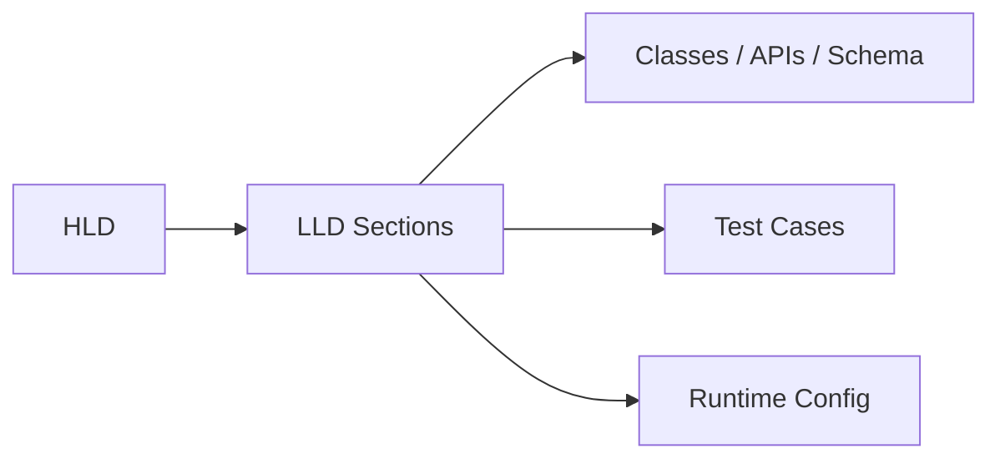

# Overview

Class Design is used for implementation-level design with concrete APIs, data models, and runtime behavior. In production systems, it should be selected for its operational envelope as much as for its feature set. The real architectural question is whether it reduces risk, improves scalability, or simplifies ownership compared with adjacent choices.

# Purpose

- Provide a reusable LLD section for class design.
- Define the constraints that shape safe use of Class Design.
- Show how Class Design interacts with the implementation design layer beneath HLD, where service contracts, data models, and code organization are specified.
- Provide decision criteria for HLD and LLD reviews.

# Architecture Placement

Class Design belongs in the implementation design layer beneath HLD, where service contracts, data models, and code organization are specified. It usually sits between application logic and the underlying runtime, storage, or cloud primitives, and it should be designed as part of the end-to-end service boundary rather than as a stand-alone utility.

# Internal Working

At runtime, Class Design implements implementation-level design with concrete APIs, data models, and runtime behavior through a small set of deterministic controls: request handling, state access, failure behavior, and observability. The key design task is to make those controls explicit so that scale, security, and recovery characteristics are predictable.

# Responsibilities

- Own the narrow contract for implementation-level design with concrete APIs, data models, and runtime behavior.
- Isolate internal implementation details from callers.
- Expose clear success, retry, and failure semantics.
- Support auditability, traceability, and operational support.
- Integrate safely with data stores, queues, or external services.

# Inputs

- Functional requirements for Class Design.
- Latency, durability, availability, and compliance requirements.
- Traffic profile, data shape, and peak load estimates.
- Integration points with adjacent services and platform controls.

# Outputs

- A deployable design for Class Design.
- Interface contracts and operational assumptions.
- Scaling, resiliency, and security decisions.
- Documented trade-offs and implementation guardrails.

# Dependencies

- HLD
- API contracts
- schema decisions
- test strategy
- configuration model

# Workflow

1. Gather workload requirements and failure assumptions.
2. Choose Class Design only if it improves the target quality attributes.
3. Define contracts, boundaries, and ownership explicitly.
4. Validate scale, security, and recovery paths before release.
5. Instrument the design with metrics, logs, and alerts.
6. Review operational playbooks and rollback behavior with the on-call team.

# When to Use

- Use Class Design when implementation-level design with concrete APIs, data models, and runtime behavior is a first-order requirement.
- Use it when the architecture needs a clear operational boundary.
- Use it when scaling, security, or consistency must be controlled deliberately.
- Use it when the team can support the associated operational model.

# When NOT to Use

- Do not use it when a simpler managed alternative satisfies the need with lower operational cost.
- Do not use it when the team cannot own the failure modes or lifecycle overhead.
- Do not use it when the requirement is exploratory and the architecture is still fluid.

# Advantages

- Provides a disciplined way to implement implementation-level design with concrete APIs, data models, and runtime behavior.
- Clarifies scaling and failure boundaries.
- Improves governance and reviewability.
- Supports repeatable deployment and rollback practices.

# Disadvantages

- Adds operational and cognitive overhead compared with simpler options.
- Can create hidden coupling if ownership boundaries are not explicit.
- May require tuning, automation, and observability to stay reliable.
- Trade-offs can become visible only after the system reaches scale.

# Scalability Considerations

- Separate stateless and stateful concerns early.
- Use horizontal scale where the component can remain stateless.
- Plan for partitioning, sharding, or queueing when load grows.
- Watch for hidden bottlenecks such as shared locks, hot keys, or single writers.

# High Availability Considerations

- Deploy critical paths across at least two failure domains.
- Validate health checks, failover, and degraded-mode behavior.
- Keep backups, replicas, or redundant capacity aligned with RTO and RPO goals.

# Security Considerations

- Minimize privileged access and scope credentials narrowly.
- Encrypt in transit and at rest where applicable.
- Log security-relevant actions for audit and incident review.
- Treat configuration and secrets as separate controlled inputs.

# Failure Handling

- Define retry, timeout, and circuit-breaker behavior where external calls exist.
- Document fallback behavior for partial outages and dependency loss.
- Prefer idempotent operations so that retries do not amplify damage.
- Use alerts that map to user-visible impact rather than raw infrastructure noise.

# Deployment Considerations

- Package the design in infrastructure as code or reproducible build artifacts.
- Use staged rollout, smoke tests, and verification gates.
- Keep configuration externalized and environment-specific values controlled.
- Align deployment topology with the intended resiliency model.

# Monitoring & Observability

- Track request volume, error rate, latency, and saturation.
- Correlate application metrics with infrastructure and dependency signals.
- Capture logs and traces that can explain behavior during incidents.
- Create dashboards for both steady-state operations and incident response.

# Performance Considerations

- Measure the critical path and remove unnecessary hops.
- Reduce serialization, network chat, and blocking operations where possible.
- Optimize for the dominant workload shape instead of theoretical edge cases.
- Use caching, batching, or precomputation only when they improve the bottleneck.

# Best Practices

- Keep the contract small and explicit.
- Document ownership, failure assumptions, and escape hatches.
- Use automation for validation, deployment, and rollback.
- Prefer observable, auditable control points over implicit behavior.

# Common Mistakes

- Treating the component as a generic catch-all service.
- Ignoring operational costs while optimizing only for feature delivery.
- Allowing implicit dependencies to accumulate without documentation.
- Skipping failure testing until production incidents expose the gap.

# Alternatives

- Implementation comments or lightweight design notes for very small changes.
- A more specialized component with fewer capabilities but lower cost.
- A lighter-weight pattern if the requirements are still uncertain.

# Related Technologies

- class design
- API design
- database schema
- error handling

# Real-world Examples

- backend service implementation specs
- SDK integration notes
- feature-level design docs

# Architecture Decision Guidelines

- Choose Class Design only when it improves the target quality attributes for implementation-level design with concrete APIs, data models, and runtime behavior.
- Record the trade-offs in the design review so the decision is reversible if requirements change.
- Make scale, security, and recovery explicit acceptance criteria.
- Treat production observability as part of the design, not an afterthought.

# Production Recommendations

- Prefer version-controlled infrastructure and configuration.
- Run failure drills and validate recovery paths in non-production first.
- Keep an owner, on-call path, and rollback plan for every critical dependency.
- Review the design again after the first production month because real usage often changes the shape of the system.
